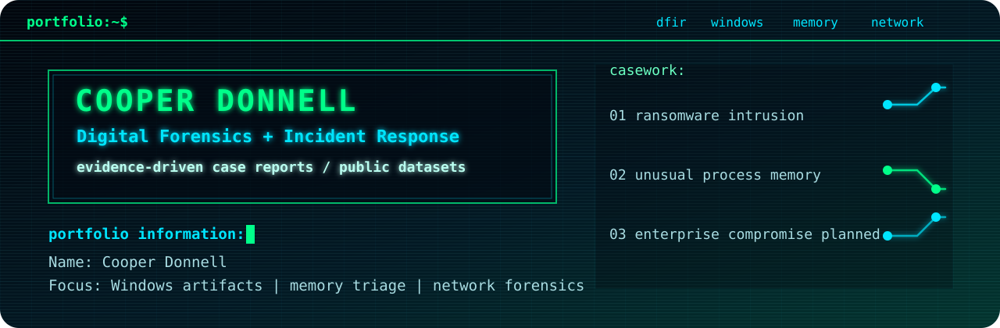
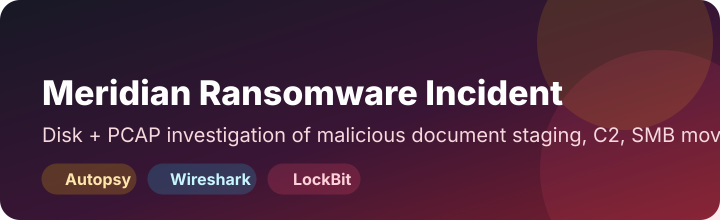

  

  
  
  
  

# DFIR Portfolio

This repository contains polished digital forensics and incident response case studies built from public evidence sets. Each investigation is scoped, evidence-driven, and written like an interview discussion artifact: what happened, what artifacts support the conclusion, what the indicators are, and what response actions make sense.

> [!NOTE]
> Raw evidence, command logs, tool output dumps, and analyst scratch notes are intentionally excluded. The repository is designed to show final investigative judgment, not clutter.

## Quick Review

| What to Open | Why It Matters |
| --- | --- |
| [Portfolio investigation index](portfolio-investigations/) | Fast path to every published DFIR case |
| [Meridian ransomware report](portfolio-investigations/01-meridian-ransomware-incident/report.md) | Disk plus PCAP analysis with initial access, C2, lateral movement, exfiltration staging, and ransomware impact |
| [HackForge memory report](portfolio-investigations/02-hackforge-unusual-process-memory/report.md) | Volatility 3 triage identifying a suspicious process, parent-child relationship, and Temp-path execution |

## Featured Investigations

| Case | Investigation Snapshot | Evidence and Skills |
| --- | --- | --- |
| [Meridian Financial Services Ransomware Incident](portfolio-investigations/01-meridian-ransomware-incident/) |  | Malicious `.docm`, PowerShell staging, C2 traffic, SMB movement, Mega-related transfer activity, LockBit indicators |
| [HackForge Unusual Process Memory Triage](portfolio-investigations/02-hackforge-unusual-process-memory/) |  | Volatility 3 process review, suspicious `scvhost.exe`, PowerShell parentage, VAD-backed Temp-path execution |

## Skills Demonstrated

| Area | Evidence in This Portfolio |
| --- | --- |
| Windows artifact analysis | MFT context, Prefetch artifacts, user profile paths, suspicious executables |
| Network forensics | DNS, HTTP, TLS, SMB, suspicious infrastructure, exfiltration indicators |
| Memory forensics | Volatility 3 `windows.info`, `pslist`, `pstree`, `cmdline`, `netscan`, `malfind`, and `vadinfo` review |
| Incident reconstruction | Timeline building, artifact correlation, cautious timestamp handling |
| Detection thinking | IOCs, ATT&CK mapping, alerting opportunities, containment and recovery recommendations |
| Professional reporting | Executive summaries, limitations, screenshot exhibits, evidence handling notes |

## Tools Used

  
  
  
  

The tool list is intentionally small. Each case uses only the tools needed to answer the investigative question cleanly.

## Repository Standard

Every published case includes:

- Executive summary
- Scope and investigative question
- Evidence inventory and integrity information
- Methodology and tools used
- Timeline or event sequence where appropriate
- Findings with artifact-level support
- MITRE ATT&CK mapping
- Indicators and detection opportunities
- Containment, eradication, and recovery recommendations
- Limitations and unanswered questions

## Roadmap

| Status | Case | Planned Focus |
| --- | --- | --- |
|  | Meridian Financial Services Ransomware Incident | Disk and PCAP ransomware investigation |
|  | HackForge Unusual Process Memory Triage | Windows memory triage |
|  | Scoped Enterprise Compromise Investigation | Endpoint, identity, and network correlation |
