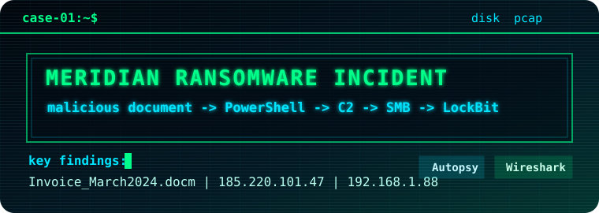
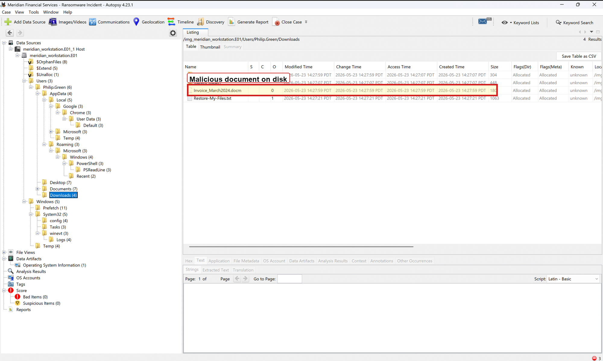

  

# Meridian Financial Services Ransomware Incident

  
  
  

## Case Summary

This investigation analyzes a public ransomware case involving a Windows workstation and network capture. The suspected incident began with a malicious macro-enabled Word document and progressed through PowerShell-based staging, command-and-control communication, defense evasion, lateral movement, data staging, and LockBit ransomware execution.

## Evidence Source

- Source: RedHatPentester DIGITAL-FORENSICS-CTF-LAB, "Meridian Financial Services - Ransomware Incident"
- Evidence files:
  - `meridian_workstation.E01`
  - `meridian_incident.pcap`
- Original ZIP MD5: `F875B60AB2DF099805978DE9A2DA74EE`

Raw evidence, command logs, and analyst scratch notes are not included in this repository. Only final reporting artifacts, evidence summaries, annotated screenshots, timelines, and derived indicators are included.

## Tools Used

- Autopsy
- Wireshark
- PowerShell `Get-FileHash`

## Key Findings

- Initial access was linked to `Invoice_March2024.docm`, a macro-enabled Word document.
- The host communicated with `meridian-invoices.com`, which resolved to `185.220.101.47`.
- The observed PowerShell cradle retrieved `stage1.ps1` from `http://meridian-invoices.com/stage1.ps1`.
- The malware configuration identified `185.220.101.47` as C2 and `https://mega.nz/upload` as the exfiltration target.
- Windows Defender real-time protection was disabled.
- Shadow copies were deleted using `vssadmin` and `wmic`.
- The attacker accessed internal host `192.168.1.88` over SMB.
- User documents were compressed into `C:\Windows\Temp\exfil_pack.zip`.
- LockBit indicators were present, including `.lockbit`, `Restore-My-Files.txt`, and a LockBit onion domain.

## Case Highlights

| Skill Signal | Evidence in This Case |
| --- | --- |
| Initial access analysis | Suspicious macro-enabled Word document and PowerShell download cradle |
| Host artifact review | MFT context, Prefetch artifacts, malicious configuration file |
| Network forensics | DNS, HTTP, TLS, SMB, Mega-related activity, LockBit onion lookup |
| IR judgment | Timeline, ATT&CK mapping, IOCs, recovery-focused recommendations |

## Repository Contents

- [report.md](report.md): Main investigation report
- [timeline.csv](timeline.csv): Condensed incident timeline
- [iocs.csv](iocs.csv): Indicators of compromise
- [evidence-notes.md](evidence-notes.md): Evidence handling and artifact notes
- [screenshots/README.md](screenshots/README.md): Screenshot index
