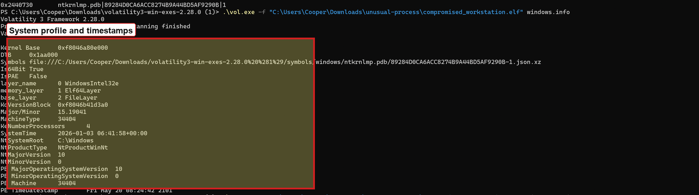
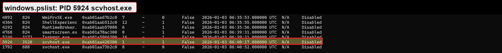
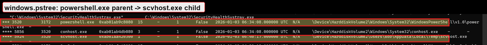
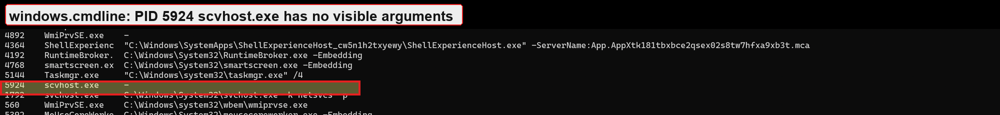
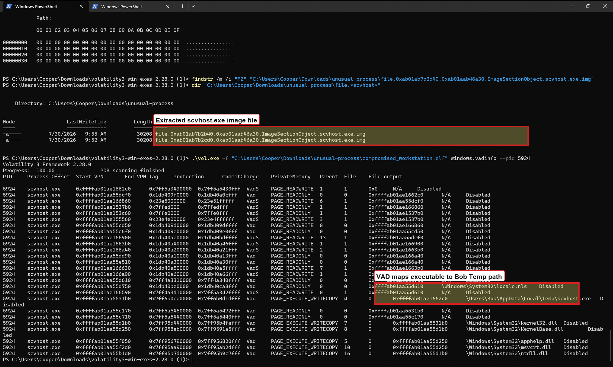

# HackForge Unusual Process Memory Triage

## Executive Summary

This investigation analyzed a public Windows memory image from HackForge's "Unusual Process" challenge. The unusual process was identified as `scvhost.exe` with PID `5924`. The process was suspicious because it masqueraded as the legitimate Windows `svchost.exe` process, was launched by `powershell.exe`, and executed from `C:\Users\Bob\AppData\Local\Temp\scvhost.exe` rather than a trusted Windows system directory.

No confirmed remote network connection was identified for `scvhost.exe`, and `malfind` did not report injected or suspicious private executable memory for the process. The primary finding is therefore a process-masquerading and suspicious-execution-path finding, supported by Volatility process, process tree, command line, network, and memory review.

## Scope

The investigation reviewed one public Windows memory capture:

```text
compromised_workstation.elf
```

The investigation focused on identifying the suspicious process, determining why it was suspicious, and documenting what memory evidence supported that conclusion.

## Evidence Handling

The archive hash was verified before analysis:

```text
Archive: unusual-process.7z
MD5:     8833BDB908601A2FBBE38B679624A8A2
```

The extracted memory image was named:

```text
compromised_workstation.elf
```

Raw evidence is not included in this repository.

## Tools Used

- Volatility 3
- PowerShell `Get-FileHash`

## System Information

Volatility identified the memory image as a Windows 10 system.

```text
Kernel base:  0xf8046a80e000
DTB:          0x1aa000
Symbol table: ntkrnlmp.pdb/89284D0CA6ACC8274B9A44BD5AF9290B-1
System time:  2026-01-03 06:41:58 UTC
PE timestamp: Fri May 20 08:24:42 2101
```

The system time was recorded from `windows.info`. The PE timestamp value appears abnormal and was not used as an incident timestamp.



## Findings

### Suspicious Process

The suspicious process was:

```text
Process: scvhost.exe
PID:     5924
PPID:    3520
Parent:  powershell.exe
Path:    C:\Users\Bob\AppData\Local\Temp\scvhost.exe
```

The process name is suspicious because it appears to imitate `svchost.exe`, a legitimate Windows service host process. The observed process name, `scvhost.exe`, swaps letters in a way that could be missed during quick review.

The execution path is also suspicious. Legitimate `svchost.exe` normally runs from:

```text
C:\Windows\System32\svchost.exe
```

This process instead ran from a user-writable Temp directory:

```text
C:\Users\Bob\AppData\Local\Temp\scvhost.exe
```



### Parent-Child Relationship

The process tree showed `scvhost.exe` as a child of `powershell.exe`:

```text
powershell.exe -> scvhost.exe
```

This is suspicious because PowerShell is commonly used for script execution, payload staging, and post-exploitation activity. A lookalike service-host process spawned by PowerShell from a Temp directory is not consistent with normal Windows service-host behavior.



### Command Line Review

The command line review showed normal Windows service-host command lines for legitimate `svchost.exe` instances and showed the suspicious `scvhost.exe` process separately. The useful finding was the process name and lineage rather than a long visible command-line argument.



### Network Activity

Network review identified `powershell.exe` with PID `3520` in network-related artifacts. The observed local address was:

```text
10.10.10.50
```

No confirmed remote TCP connection was tied directly to `scvhost.exe`. The available network evidence supports suspicion around the parent process, but it does not prove that `scvhost.exe` maintained a remote connection.

### Injection Review

`malfind` did not report injected or suspicious private executable memory regions for `scvhost.exe`.

This reduces confidence in process-injection as the primary behavior, but it does not clear the process. The suspicious process name, parentage, path, and VAD/file evidence are sufficient to identify `scvhost.exe` as the unusual process in this case.

### VAD and File Mapping Review

Because `malfind` did not identify suspicious injected memory for `scvhost.exe`, `vadinfo` was used as a focused follow-up for PID `5924`. The VAD output showed an executable image mapping associated with the suspicious process path:

```text
\Users\Bob\AppData\Local\Temp\scvhost.exe
```

This supports that the unusual process was backed by an executable in the user's Temp directory, reinforcing the process masquerading finding.



## MITRE ATT&CK Mapping

| Tactic | Technique | Evidence |
| --- | --- | --- |
| Defense Evasion | Masquerading | `scvhost.exe` imitates legitimate `svchost.exe` |
| Defense Evasion | Match Legitimate Name or Location | Process used a Windows-service-like name from a user Temp path |
| Execution | Command and Scripting Interpreter: PowerShell | Parent process was `powershell.exe` |

## Indicators

| Type | Value | Context |
| --- | --- | --- |
| Process | `scvhost.exe` | Misspelled `svchost.exe` lookalike |
| PID | `5924` | Suspicious process |
| Parent process | `powershell.exe` | Parent of suspicious process |
| Parent PID | `3520` | PowerShell process associated with suspicious child |
| File path | `C:\Users\Bob\AppData\Local\Temp\scvhost.exe` | Suspicious user-writable execution path |
| Local IP | `10.10.10.50` | Local host address observed in network review |

## Conclusion

The unusual process was `scvhost.exe` with PID `5924`. It was suspicious because it used a lookalike name for the legitimate Windows `svchost.exe`, was spawned by `powershell.exe`, and executed from `C:\Users\Bob\AppData\Local\Temp\scvhost.exe`. No direct network connection or injected memory region was confirmed for `scvhost.exe`, but the process name, parent-child relationship, and execution path were sufficient to identify it as the anomalous process in the memory image.

## Recommendations

- Alert on processes launched from user-writable Temp directories that mimic Windows system process names.
- Monitor PowerShell child processes, especially when PowerShell launches executables from user profile paths.
- Add detection logic for near-match process names such as `scvhost.exe` versus `svchost.exe`.
- Collect endpoint disk artifacts when a suspicious memory process maps to a user-writable executable path.
- Preserve PowerShell logs, command line telemetry, and EDR process lineage when available.

## Limitations

- The case was limited to a memory image; no disk image or event logs were reviewed.
- Volatility did not report a confirmed remote connection tied directly to `scvhost.exe`.
- `malfind` did not identify suspicious injected memory for `scvhost.exe`.
- The PE timestamp shown by `windows.info` appeared abnormal and was not treated as reliable incident time.
- Some screenshots prioritize the useful result rows rather than the full command text because the command paths were too long to fit cleanly in the terminal view.
