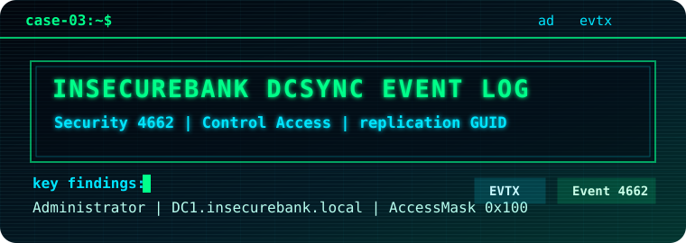

<p align="center">
  
</p>

# InsecureBank DCSync Event Log Investigation

<p>
  
  
  
</p>

## Case Summary

This investigation analyzes a public Windows Security event log sample containing Event ID `4662` records associated with Active Directory object access. The key finding is that the `Administrator` user account performed `Control Access` operations on `DC1.insecurebank.local` with replication-related GUIDs present in the event properties, behavior consistent with DCSync-style credential access.

This is intentionally scoped as an event-log investigation, not a full domain compromise investigation.

## Evidence Source

- Source: EVTX-ATTACK-SAMPLES, Credential Access
- Evidence file: `CA_DCSync_4662.evtx`
- Category: Windows Security event log
- SHA256: `679B2FF27AF6C932C07BF3E81391E455FAE98E69BF3AFF0F524E31AADC418131`
- File page: `https://github.com/sbousseaden/EVTX-ATTACK-SAMPLES/blob/master/Credential%20Access/CA_DCSync_4662.evtx`

Raw evidence, command logs, and analyst scratch notes are not included in this repository. Only final reporting artifacts, evidence summaries, screenshots, timelines, and derived indicators are included.

## Tools Used

- Windows Event Viewer
- PowerShell `Get-FileHash`

## Investigation Goal

Answer one core question:

```text
Was Active Directory replication-style access observed, which account performed it, and what event-log artifacts support that conclusion?
```

## Key Findings

- The EVTX contained `3` Security Event ID `4662` records.
- The events were recorded on `DC1.insecurebank.local`.
- The accessing account was `insecurebank\Administrator`.
- The object server was `DS`, indicating Directory Service object access.
- The access type was `Control Access` with `AccessMask` value `0x100`.
- The event properties included `{1131f6ad-9c07-11d1-f79f-00c04fc2dcd2}`, a directory replication rights GUID commonly associated with DCSync detection.
- The activity is consistent with DCSync-style credential access because a user account exercised replication-related control access against Active Directory objects.

## Case Highlights

| Skill Signal | Evidence in This Case |
| --- | --- |
| Windows event-log review | Security Event ID `4662` object access records |
| Active Directory context | `Object Server: DS` on `DC1.insecurebank.local` |
| Credential-access analysis | Replication-related GUID in `Properties` with `AccessMask: 0x100` |
| Defensive judgment | Detection guidance excludes approved DC machine accounts and known sync accounts |

## Repository Contents

- [report.md](report.md): Main investigation report
- [timeline.csv](timeline.csv): Condensed event timeline
- [iocs.csv](iocs.csv): Indicators and detection fields
- [evidence-notes.md](evidence-notes.md): Evidence handling and artifact notes
- [screenshots/README.md](screenshots/README.md): Screenshot index

## Evidence Policy

Raw evidence and internal working material are not included in this repository. Only final reports, evidence summaries, indicators, timelines, and supporting screenshots should be committed.
