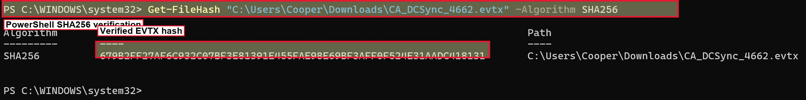
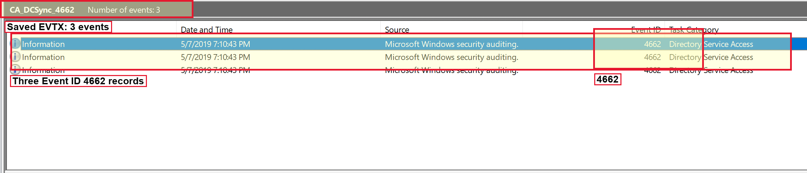
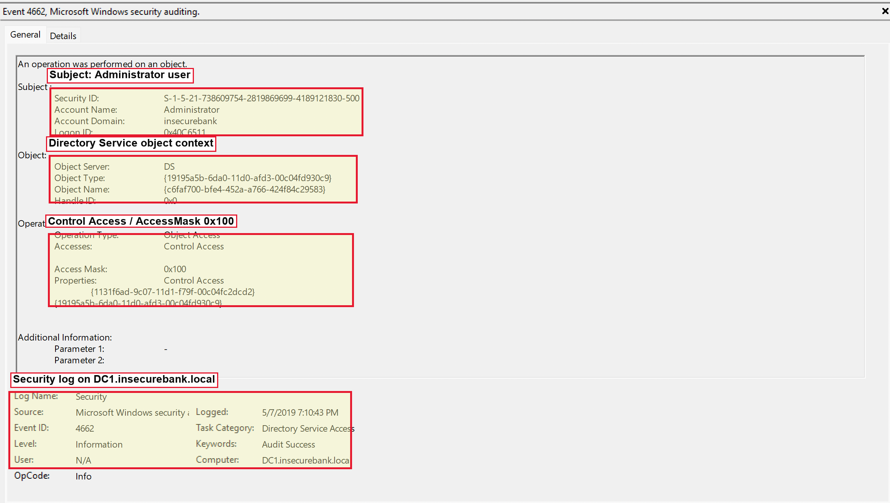
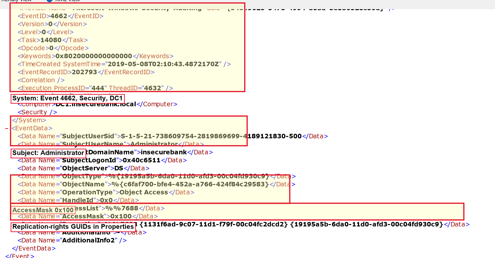

# InsecureBank DCSync Event Log Investigation

## Executive Summary

This investigation reviewed a public Windows Security event log sample containing Active Directory object access events associated with DCSync-style credential access. The EVTX contained three Event ID `4662` records on `DC1.insecurebank.local` showing the `insecurebank\Administrator` user account performing `Control Access` operations against Directory Service objects.

The most important artifact was the `Properties` field containing `{1131f6ad-9c07-11d1-f79f-00c04fc2dcd2}`, a directory replication rights GUID commonly used in DCSync detection logic. Because the activity was performed by a user account rather than a domain controller machine account or known directory synchronization account, the events are consistent with suspicious DCSync-style credential access.

## Scope

The investigation reviewed one public Windows event log sample:

```text
CA_DCSync_4662.evtx
```

The analysis focused on identifying the account, host, event type, access rights, and event properties that support a DCSync-style finding.

## Evidence Handling

The EVTX hash was verified before analysis:

```text
SHA256: 679B2FF27AF6C932C07BF3E81391E455FAE98E69BF3AFF0F524E31AADC418131
```

Raw evidence is not included in this repository.



## Tools Used

- Windows Event Viewer
- PowerShell `Get-FileHash`

## Findings

### Event Set

Event Viewer showed three records in the saved EVTX:

```text
Log/channel: Security
Event ID:    4662
Event count: 3
Task:        Directory Service Access
```



Security Event ID `4662` records that an operation was performed on an object. In this case, the object access occurred against the Directory Service object server.

### Subject Account

The subject account was:

```text
Account Name:   Administrator
Account Domain: insecurebank
Security ID:    S-1-5-21-738609754-2819869699-4189121830-500
Logon ID:       0x40C6511
```

The account is a user account, not a domain controller machine account. This matters because domain controller replication activity is expected from domain controllers and approved synchronization services, but it is suspicious when exercised by an unexpected user account.

### Directory Service Object Access

The object access context was:

```text
Object Server: DS
Object Type:   {19195a5b-6da0-11d0-afd3-00c04fd930c9}
Object Name:   {c6faf700-bfe4-452a-a766-424f84c29583}
```

The operation details were:

```text
Operation Type: Object Access
Accesses:       Control Access
Access Mask:    0x100
```



### Replication-Related Properties

The XML view showed:

```xml
<EventID>4662</EventID>
<Channel>Security</Channel>
<Computer>DC1.insecurebank.local</Computer>
<Data Name="SubjectUserName">Administrator</Data>
<Data Name="SubjectDomainName">insecurebank</Data>
<Data Name="ObjectServer">DS</Data>
<Data Name="AccessMask">0x100</Data>
<Data Name="Properties">%%7688 {1131f6ad-9c07-11d1-f79f-00c04fc2dcd2} {19195a5b-6da0-11d0-afd3-00c04fd930c9}</Data>
```

The key replication-rights GUID observed was:

```text
{1131f6ad-9c07-11d1-f79f-00c04fc2dcd2}
```

This GUID is commonly associated with Active Directory replication rights used in DCSync detection. The other observed GUID, `{19195a5b-6da0-11d0-afd3-00c04fd930c9}`, was also present in the event object context and properties, but the strongest DCSync indicator in this sample is the replication-rights GUID paired with `Control Access`.



## Timeline Summary

| Time | Source | Event |
| --- | --- | --- |
| 2019-05-07 19:10:43 local display time | Event Viewer | Three Security Event ID `4662` records showed `insecurebank\Administrator` performing Directory Service `Control Access` operations |
| 2019-05-08 02:10:43.4872170 UTC | EVTX XML `SystemTime` | Event creation time recorded for the reviewed `4662` record |

## MITRE ATT&CK Mapping

| Tactic | Technique | Evidence |
| --- | --- | --- |
| Credential Access | OS Credential Dumping: DCSync | Event ID `4662`, `AccessMask: 0x100`, `Control Access`, and replication-related GUID in `Properties` |

## Indicators and Detection Fields

| Type | Value | Context |
| --- | --- | --- |
| Host | `DC1.insecurebank.local` | Domain controller that recorded the Security event |
| Account | `insecurebank\Administrator` | Subject account performing access |
| Event ID | `4662` | Directory Service object access event |
| Access Mask | `0x100` | Control Access |
| Accesses | `Control Access` | Access type used in the event |
| GUID | `{1131f6ad-9c07-11d1-f79f-00c04fc2dcd2}` | Replication-related GUID associated with DCSync detection |
| Object Server | `DS` | Directory Service object access |

## Detection Opportunities

- Alert on Security Event ID `4662` where `AccessMask` is `0x100` and `Properties` contains replication-rights GUIDs such as `{1131f6aa-9c07-11d1-f79f-00c04fc2dcd2}`, `{1131f6ad-9c07-11d1-f79f-00c04fc2dcd2}`, or `{89e95b76-444d-4c62-991a-0facbeda640c}`.
- Exclude expected domain controller machine accounts and approved directory synchronization service accounts.
- Correlate suspicious `4662` activity with logon events, privileged group membership, recent account changes, and unusual source hosts.
- Alert when built-in privileged accounts such as `Administrator` perform replication-related access outside expected administrative workflows.

## Response Recommendations

- Treat the account as potentially compromised until the activity is explained.
- Disable or rotate credentials for the suspected account.
- Review which accounts have directory replication permissions.
- Search domain controller logs for related logon, privilege use, and directory access events around the same timestamp.
- Identify whether credential material may have been accessed and scope affected accounts.
- If domain credential compromise is confirmed, plan privileged account resets and a controlled double `KRBTGT` reset.
- Review and reduce standing privileges for built-in or highly privileged accounts.

## Limitations

- The case reviewed a single EVTX sample, not full domain controller telemetry.
- The event indicates replication-style access, but the sample alone does not prove which credential material was successfully retrieved.
- Source workstation, process lineage, and authentication source were not available from the provided screenshots.
- Only one representative event was reviewed in detail; Event Viewer showed three total `4662` records.

## References

- Evidence source: `https://github.com/sbousseaden/EVTX-ATTACK-SAMPLES/blob/master/Credential%20Access/CA_DCSync_4662.evtx`
- MITRE ATT&CK: `https://attack.mitre.org/techniques/T1003/006/`
- Microsoft Event 4662 reference: `https://learn.microsoft.com/en-us/previous-versions/windows/it-pro/windows-10/security/threat-protection/auditing/event-4662`
