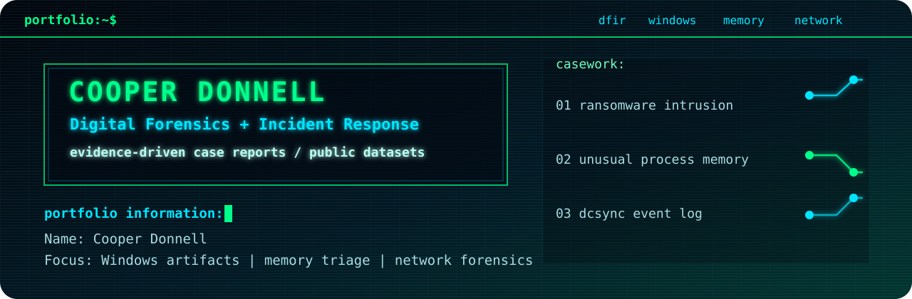
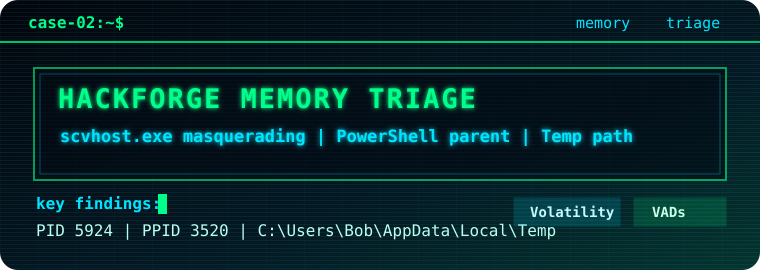

  

# DFIR Portfolio Investigations

This folder contains polished DFIR case studies. Each investigation is written as a defensible case report with evidence handling notes, timeline, indicators, annotated screenshots, MITRE ATT&CK mapping, recommendations, and limitations.

## Published Investigations

| Case | Visual | Focus | Tools |
| --- | --- | --- | --- |
| [Meridian Financial Services Ransomware Incident](01-meridian-ransomware-incident/) |  | Windows disk and PCAP analysis of a LockBit-style ransomware intrusion | Autopsy, Wireshark, PowerShell |
| [HackForge Unusual Process Memory Triage](02-hackforge-unusual-process-memory/) |  | Windows memory triage for suspicious process activity | Volatility 3, PowerShell |
| [InsecureBank DCSync Event Log Investigation](03-insecurebank-dcsync-eventlog/) |  | Active Directory Security event-log analysis for DCSync-style credential access | Event Viewer, PowerShell |

## Review Path

1. Start with each case `README.md` for a fast summary.
2. Open `report.md` for the full analysis narrative.
3. Review `iocs.csv`, `timeline.csv`, and annotated screenshots for supporting artifacts.

## Evidence Policy

Raw evidence files, tool output dumps, command logs, and analyst scratch notes are not included in this repository. Public evidence sources are cited in each case, and the repository contains only final reports, evidence summaries, annotated screenshots, timelines, and indicators.
